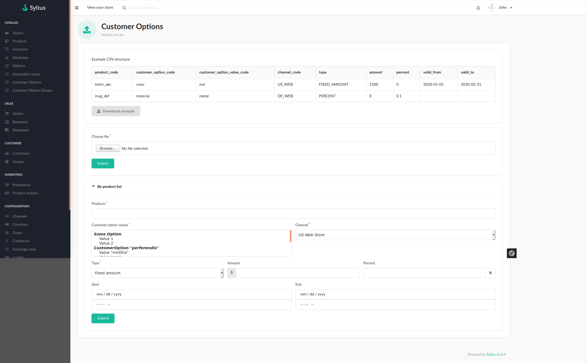

## Price import
You can import customer option prices either by csv file or by using a form.
Both types of import can be done on `http://localhost/admin/customer-options/import-prices`.
You'll see two forms:
- One to upload a csv file
- One to add prices for a list of products

Keep in mind that these forms can only **add** prices, **not** delete them.

