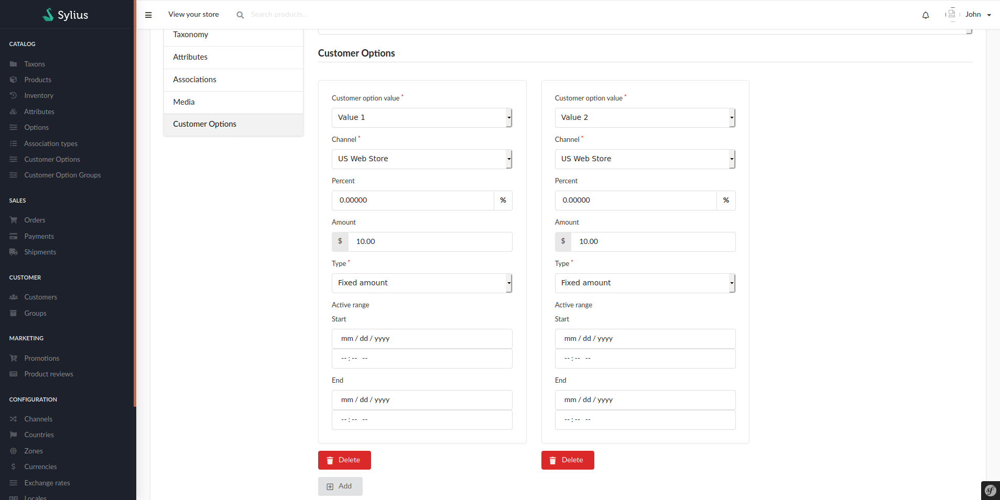

## Overriding customer option prices

You can override customer option prices for single products in the customer options tab on the product update page.

You can specify a time period during which an override should be active. 
These time periods cannot overlap per customer option value & channel. \
The start date signals when the override starts to be active,
the end date signals when the override ceases to be active and a new override may start. \
So, when an override ends at 2020-04-01 00:00:00 & another starts 2020-04-01, they don't count as overlapping.
